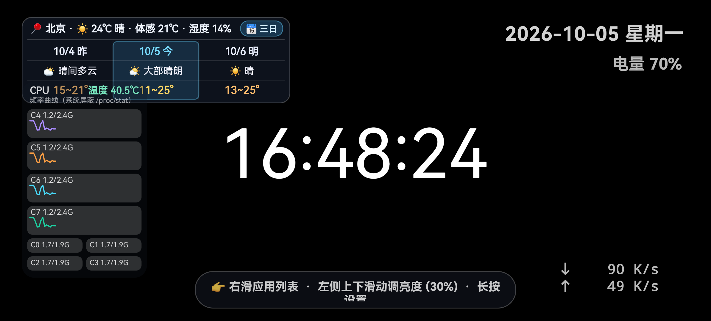
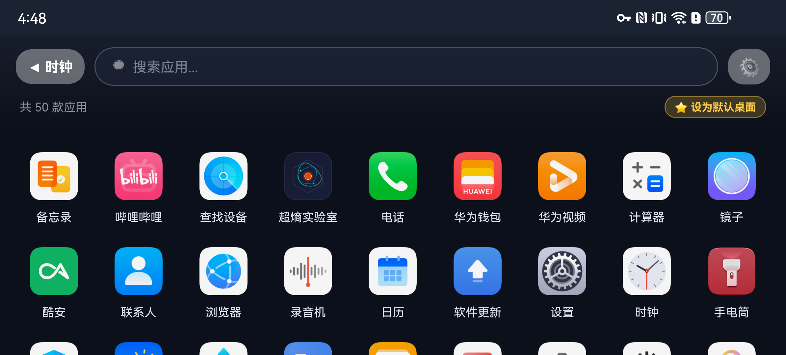
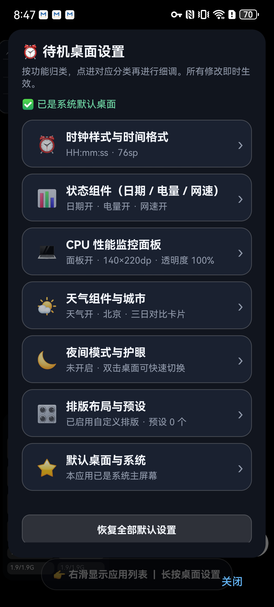
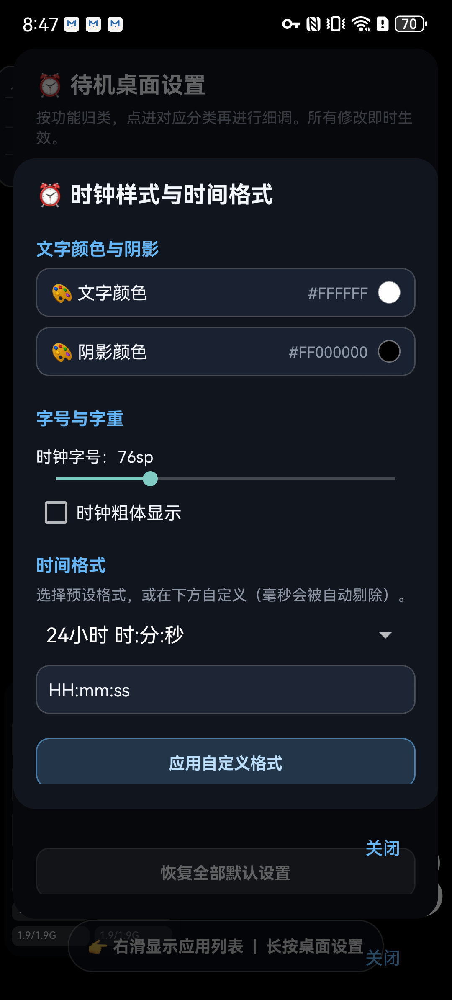

# 待机桌面 ClockLauncher

一个把手机变成**待机桌面时钟**的 Android 桌面（Launcher）应用：默认全屏显示大号时钟，右滑呼出应用列表，可直接设为系统默认桌面。

> 定位：把闲置手机长期摆在床头/桌面当时钟用，因此手机上的"桌面时钟"能力做了完整移植（天气、CPU、网速、电量、防烧屏、夜间模式），在此之上补齐了 Launcher 该有的应用列表与 HOME 键行为。

---

## 功能一览

### 待机桌面时钟（默认页，真全屏）

| 组件 | 说明 |
|---|---|
| 大号时钟 | 字号 36~180sp、自定义颜色/阴影/粗体、时间格式预设或自定义（毫秒自动剔除） |
| 日期与星期 | 可独立开关、调色、调字号、加粗 |
| 电池电量 | 实时电量与充电状态（⚡），可独立开关与调样式 |
| 实时网速 | 上下行速率差分采样，自动切换 B/s、K/s、M/s、G/s |
| 天气卡片 | Open-Meteo 免密钥，三日对比 / 逐小时走势两种卡片，城市可查询绑定 |
| CPU 监控 | 每核心频率（或占用率）曲线 + CPU 温度，按真实物理核心数展示 |
| 防烧屏 | 每 90 秒对全部组件做 28 秒平滑微漂移，保护 OLED |
| 夜间模式 | 双击桌面切换，支持定时时段、最低亮度、极暗遮罩；夜间模式优先级最高 |
| 自动亮度 | 按环境光对数映射自动调节，可设最暗/最亮档；也支持跟随系统亮度 |

### 应用列表（右滑呼出）

- 全量应用扫描 + 中文拼音智能排序
- 顶部实时搜索过滤
- 自适应网格（竖屏 4 列，横屏 6~9 列）
- 单击启动，长按弹出快捷菜单（打开 / 系统详情 / 卸载 / 复制包名）
- 按包变更广播自动刷新列表

### Launcher 行为

- `HOME` 键常驻：任意界面按 HOME 回到待机时钟
- 返回键分层：应用列表按返回回时钟；时钟页按返回不退出
- 一键设为系统默认桌面（Android 10+ 走 `RoleManager`，低版本引导到系统设置）

### 个性化设置中心（分类归口，不平铺）

长按桌面空白处打开，主界面只列 7 个分类入口，每项带实时状态摘要：

1. **⏰ 时钟样式与时间格式** — 颜色、阴影、字号、粗体、格式预设/自定义
2. **📊 状态组件** — 日期、电量、网速各自独立开关/颜色/字号/粗体
3. **💻 CPU 监控面板** — 开关、面板宽高、背景透明度
4. **🌤️ 天气组件** — 城市绑定、坐标、刷新、卡片模式、文字与卡片外观、文字缩放
5. **🌙 夜间模式** — 手动/定时、时段、最低亮度、极暗遮罩深度
6. **🖐️ 手势与屏幕亮度** — 亮度模式（手动/自动/跟随系统）、自动亮度范围、实时环境光
7. **🎛️ 排版布局与预设** — 可视化拖拽排版、恢复默认、预设增删改、配置 JSON 导入导出

### 手势

| 手势 | 行为 |
|---|---|
| 右滑 / 左滑 / 上滑 | 呼出应用列表 |
| 左侧约 1/6 区域上下滑动 | 调节屏幕亮度（自动切回手动模式） |
| 双击桌面空白处 | 切换夜间模式 |
| 长按桌面空白处 | 打开设置中心 |
| 轻触天气卡片 | 切换三日 / 逐小时视图 |

---

## 截图

| 待机时钟（全屏） | 应用列表 |
|---|---|
|  |  |

| 设置中心（分类入口） | 时钟样式面板 |
|---|---|
|  |  |

---

## 安装

从 [Releases](../../releases) 下载最新 APK 安装，或自行构建。

设为默认桌面：应用内「设置中心 → 默认桌面与系统」，或系统「设置 → 应用 → 默认应用 → 主屏幕」。

---

## 构建

```bash
# 环境：JDK 17 + Android SDK (platform 35 / build-tools 35.0.0)
./gradlew assembleDebug
# 产物：app/build/outputs/apk/debug/app-debug.apk

./gradlew assembleRelease   # 需要 keystore.properties，缺失时回退为 debug 签名
```

可选签名配置 `keystore.properties`（仓库不包含）：

```properties
storeFile=release.jks
storePassword=...
keyAlias=...
keyPassword=...
```

推 `v*` 标签会触发 GitHub Actions 自动构建并挂到 Release 上，也支持在 Actions 页面手动触发。

---

## 技术要点

- **纯 Java + 无第三方运行时依赖**，仅用 AndroidX（appcompat / recyclerview / viewpager2）+ Material
- 界面全部代码构建（无 XML 布局），组件 `minSdk 24 / targetSdk 35`
- **CPU 核心数**：不用 `Runtime.availableProcessors()`（会被 ROM 的 cpuset 限制与内核热插拔影响，8 核机常只显示 4 核），改为解析 `/sys/devices/system/cpu/possible`，逐级回退 `present` → 目录扫描；`/proc/stat` 按真实 CPU id 对齐，离线核心灰显占位
- **CPU 数据源三级降级**：`/proc/stat` 真实占用率 → `time_in_state` 窗口平均频率 → `scaling_cur_freq` 瞬时频率。部分 ROM 屏蔽 `/proc/stat` 时如实标注为"频率曲线"，不把频率冒充成占用率
- **自动亮度**：`log10(lux)` 归一化（人眼近似对数感知）+ 0.30 低通滤波 + 变化不足 1% 不下发，避免灯光抖动导致闪烁
- **亮度手势**：在 `onInterceptTouchEvent` 的 DOWN 阶段记录起点，避免天气卡片等可点击子 View 吞掉 DOWN 导致手势失效；按"起手方向"区分纵向调亮度与横向翻页
- **弹窗防误触**（`TouchGuardLayout`）：弹窗在手指仍按下时创建，系统会把该手势剩余的 UP 投递给新窗口，导致"点开取色器瞬间就把手指位置的颜色取走"。弹窗显示后 320ms 内吞掉触摸事件
- **取色器**：初始色为纯黑时 HSV 的 V=0，会让 `HSVToColor(h,s,0)` 恒为黑色、色域被压成全透明。取色时自动把 V 抬到满亮度，色域保留最低可见度

---

## 已知限制

- 应用列表按 `CATEGORY_LAUNCHER` 扫描，不展示无启动入口的应用
- 自动亮度依赖环境光传感器，无该硬件的设备会自动降级为手动亮度
- CPU 占用率依赖 `/proc/stat` 可读；被 ROM 屏蔽时显示频率而非占用率（面板会明确标注）
- 天气数据来自 Open-Meteo 公共接口，需要网络；20 分钟内走本地缓存

---

## 许可

个人项目，可自由参考。
